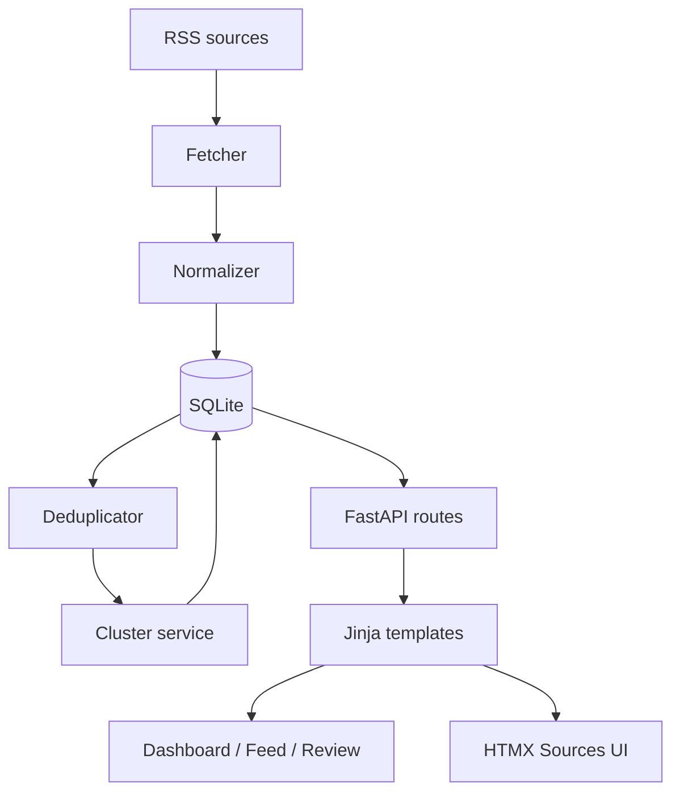

# Morti News Digest


`Morti News Digest` — портфолио-проект локального новостного дайджеста. Он
загружает публичные RSS-ленты, сохраняет метаданные статей в SQLite,
нормализует ссылки и текст, объединяет похожие публикации в кластеры и даёт
понятный FastAPI/Jinja2-интерфейс для просмотра результата.

## Проблема

Новостные сайты часто публикуют одни и те же события под разными заголовками.
Без группировки пользователь видит дубли, теряет контекст и не понимает, какие
источники подтверждают одну и ту же историю.

## Решение

Проект показывает минимальный, но рабочий workflow:

1. вести список RSS-источников;
2. вручную запускать загрузку статей;
3. нормализовать данные из RSS;
4. дедуплицировать и кластеризовать похожие новости;
5. проверять результат в dashboard, feed и review-страницах.

## Основные возможности

- Dashboard со сводкой по источникам, статьям, кластерам и последнему fetch.
- HTMX-интерфейс `/sources` для фильтрации, включения, отключения, тестирования
  и массовой обработки RSS-лент.
- Лента `/feed` с карточками кластеров, количеством статей и уникальных
  источников.
- Страница `/review` для ручной проверки качества кластеризации.
- История запусков `/fetch-runs` с результатами по каждой RSS-ленте.
- Настройки `/settings` для базовых параметров отображения и обработки.
- Health-check `/health`, возвращающий `{"status": "ok"}`.
- Локальные pytest-тесты и GitHub Actions CI.

## Скриншоты

Скриншоты пока зарезервированы как будущая документация интерфейса:

- Dashboard: `docs/screenshots/dashboard.png`
- Sources: `docs/screenshots/sources.png`
- Feed: `docs/screenshots/feed.png`
- Review: `docs/screenshots/review.png`
- Fetch run: `docs/screenshots/fetch-run.png`
- Settings: `docs/screenshots/settings.png`

## Архитектура



Подробности описаны в `docs/architecture.md`.

## Технологический стек

- Python 3.12+
- FastAPI
- Jinja2
- HTMX
- SQLAlchemy
- SQLite
- httpx
- feedparser
- Beautiful Soup
- RapidFuzz
- pytest
- Ruff

## Быстрый старт

```bash
python -m venv .venv
source .venv/bin/activate
python -m pip install -e ".[dev]"
python -m app.db.init_db
uvicorn app.main:app --reload
```

После запуска откройте <http://127.0.0.1:8000/>.

## Валидация демо

Для проверки логики без зависимости от сети используйте локальный fixture:

```bash
python -m app.cli load-demo
python -m app.cli stats
```

Ожидаемая форма результата: статьи загружены, кластеров меньше, чем статей, а
часть сюжетов объединена в multi-article clusters.

## Operational source catalog

`/sources` shows only operational feed subscriptions with real RSS/Atom
URLs. The seeded catalog must not contain empty `feed_url` values,
`example.com` placeholders, third-party RSS generators, or API/licensed-only
rows masquerading as fetchable feeds.

Media outlets without a configured public RSS/Atom feed are not inserted into
the operational source table. API-only, licensed, paywalled, or not-yet-verified
outlets are tracked separately in `docs/source_wishlist.md`.

Useful commands:

```bash
python -m app.cli seed-all-candidates
python -m app.cli seed-verified-feeds
python -m app.cli report-placeholder-sources
python -m app.cli cleanup-placeholder-sources
```

Use `seed-all-candidates` to seed the full real-URL catalog, even if a feed is
temporarily unreachable from the local network. Use `seed-verified-feeds` to
probe first and seed only feeds that currently return HTTP 200 with parsed
entries. Use `report-placeholder-sources` to audit an existing local database
before cleanup.

## Реальный RSS workflow

Для реального RSS-сценария:

```bash
python -m app.db.init_db
python -m app.cli seed-all-candidates
python -m app.cli fetch
python -m app.cli cluster
python -m app.cli stats
```

Если нужно очистить только статьи и кластеры, сохранив источники, настройки и
историю запусков, используйте:

```bash
python -m app.cli clear-articles
```

Команда `python -m app.cli refetch` выполняет `fetch`, `cluster` и `stats`
последовательно.

## Workflow управления источниками

1. Откройте `/sources`.
2. Отфильтруйте ленты по языку, стране, категории, статусу URL или последнему
   результату fetch.
3. Заполните или исправьте RSS URL.
4. Нажмите `Test feed now`, чтобы проверить конкретную ленту.
5. Включите только fetchable-ленты.
6. Используйте массовые действия для видимых записей.
7. Запустите `Fetch enabled feeds now` и проверьте результат в `/fetch-runs`.

Текущая реализация `/sources` уже использует partial-шаблоны HTMX:
`source_filters.html`, `source_summary.html`, `source_table.html`,
`source_row.html`, `source_flash.html` и `source_workspace.html`.

## Настройки

Страница `/settings` хранит простые параметры приложения: фильтр языка по
умолчанию, сортировку feed, размер страницы и retention для статей. Значение
retention `0` означает «хранить всегда».

## Тестирование

```bash
python -m pytest -q
python -m ruff check app tests
```

CI запускает те же проверки в GitHub Actions: `.github/workflows/ci.yml`.

## Ограничения

- Только SQLite; PostgreSQL и миграции пока намеренно не добавлены.
- Нет Docker-окружения.
- Нет фонового scheduler, Celery или Redis.
- Нет аутентификации и пользовательских аккаунтов.
- Нет LLM-саммаризации, embeddings и семантического поиска.
- Нет полного scraping статей: используется RSS metadata.
- Доступность публичных RSS URL может меняться со временем.

## Roadmap

- Добавить реальные скриншоты в `docs/screenshots/`.
- Улучшить визуальную полировку dashboard и review-страниц.
- Добавить Alembic перед активным развитием схемы БД.
- Подготовить PostgreSQL и Docker только после стабилизации локального
  прототипа.
- Расширить диагностику качества кластеризации.
