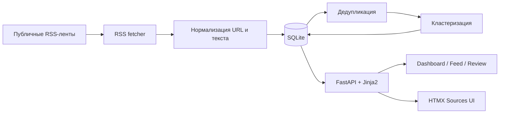
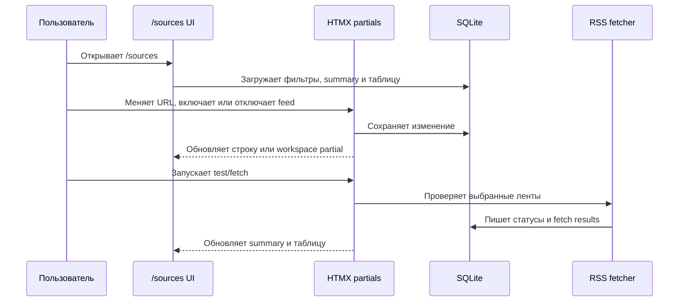

# Архитектура Morti News Digest

## Обзор архитектуры

Morti News Digest — локальный прототип новостного дайджеста на FastAPI,
SQLite, SQLAlchemy и Jinja2. Приложение разделено на несколько слоёв:

- `app/main.py` подключает FastAPI-приложение, статические файлы и роуты.
- `app/web/routes.py` содержит веб-страницы, HTMX-эндпоинты и ручной запуск
  RSS-загрузки.
- `app/services/` содержит доменную логику: загрузку RSS, нормализацию,
  дедупликацию, кластеризацию, настройки и работу с источниками.
- `app/db/` содержит модели SQLAlchemy, инициализацию SQLite и фабрику сессий.
- `app/web/templates/` содержит Jinja-шаблоны для dashboard, feed, review,
  settings, fetch runs и управления источниками.

## Поток данных

1. Пользователь настраивает источники на странице `/sources`.
2. Ручной запуск fetch получает RSS-entries из включённых лент.
3. Сервис нормализации приводит URL, заголовки и summary к стабильному виду.
4. Дедупликатор отбрасывает уже известные статьи.
5. Кластеризация объединяет похожие статьи в сюжетные группы.
6. Веб-интерфейс показывает статистику, ленту кластеров и страницу ревью.

## Сущности базы данных

- `NewsSource` — издание или новостной источник: страна, тип, рейтинг
  надёжности, bias-профиль и служебные заметки.
- `FeedSubscription` — конкретная RSS-лента источника: URL, язык, категория,
  статус доступности, флаг включения и последние результаты fetch.
- `Article` — сохранённая RSS-статья с нормализованным текстом, canonical URL,
  source/feed-связями и языком.
- `StoryCluster` — группа статей, которые описывают один информационный повод.
- `ClusterArticle` — связь статьи с кластером, тип совпадения и similarity score.
- `FetchRun` — ручной запуск загрузки RSS с агрегированной статистикой.
- `FeedFetchResult` — результат fetch по отдельной ленте внутри `FetchRun`.
- `AppSetting` — простые настройки интерфейса и поведения приложения.

## Pipeline кластеризации

1. Для каждой статьи строятся нормализованные поля и стабильные хэши.
2. Сначала проверяются точные совпадения по canonical URL и текстовому хэшу.
3. Если точного совпадения нет, статья сравнивается с недавними статьями на
   том же языке.
4. Похожесть считается через fuzzy-сопоставление нормализованного заголовка и
   summary.
5. Статья добавляется в существующий кластер при достижении порога похожести;
   иначе создаётся новый кластер.
6. Метаданные кластера обновляются по lead article, временному диапазону и
   количеству связанных статей.

## Workflow управления источниками

Страница `/sources` использует partial-шаблоны для фильтров, summary, таблицы и
строк источников. Это сохраняет основной шаблон компактным и позволяет HTMX
обновлять только нужные области страницы.
